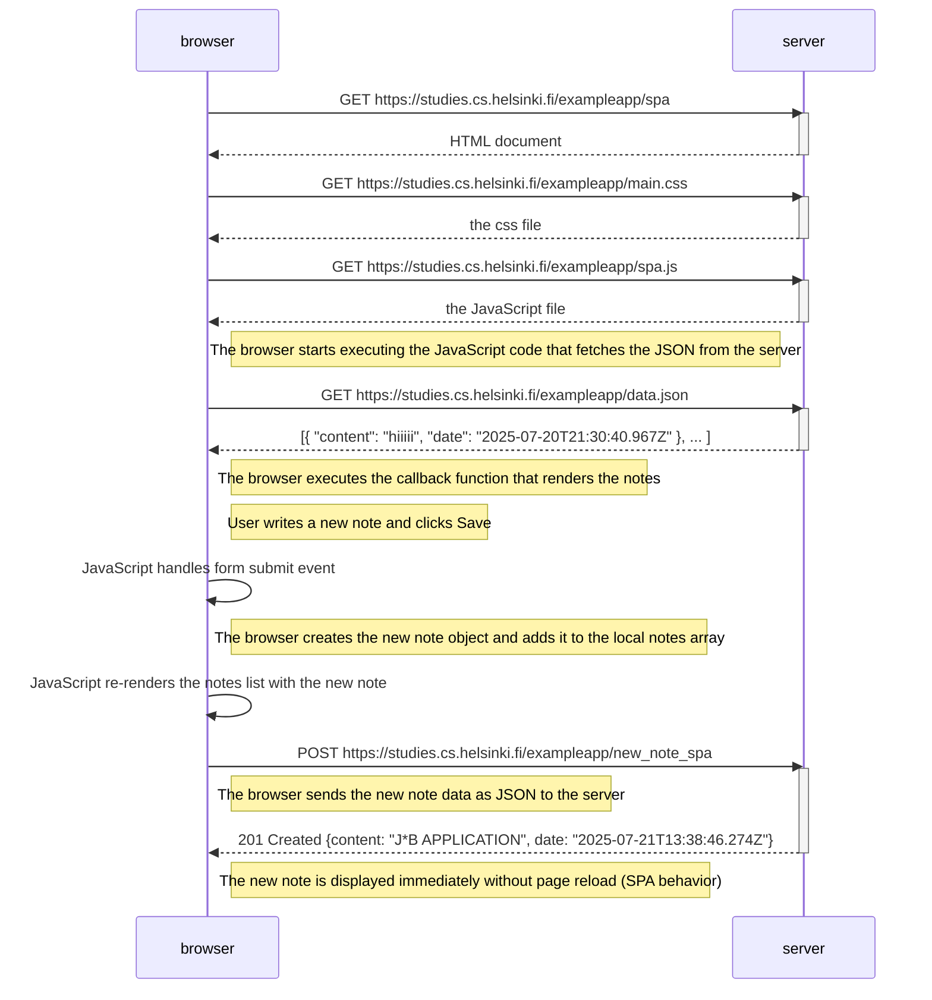
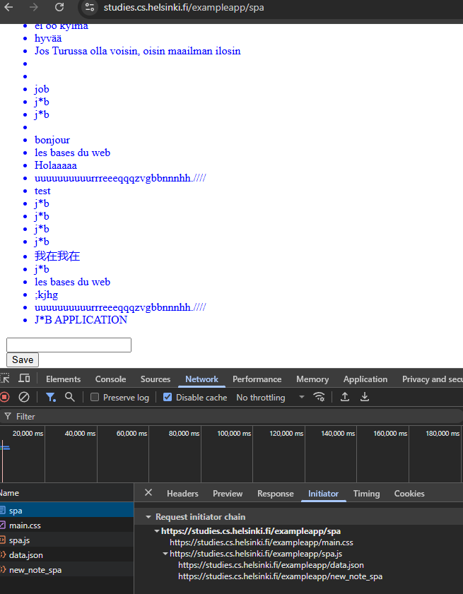
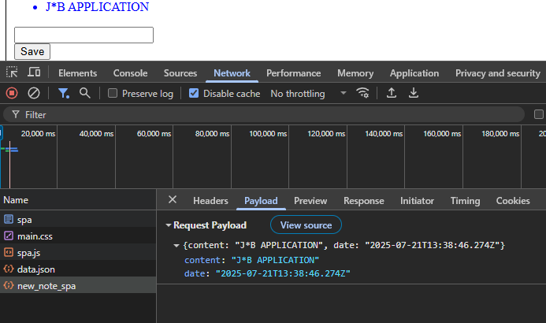
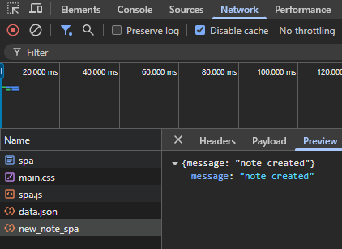
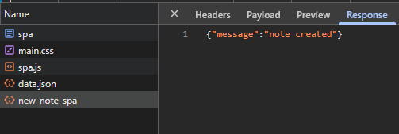
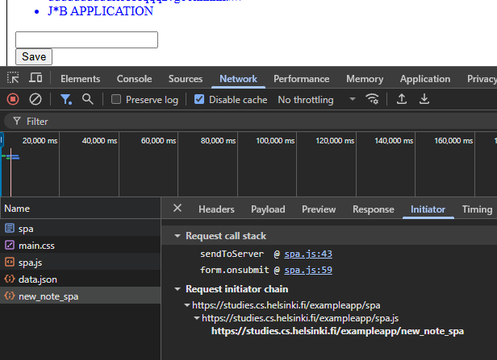

```mermaid
sequenceDiagram
    participant browser
    participant server

    browser->>server: GET https://studies.cs.helsinki.fi/exampleapp/spa
    activate server
    server-->>browser: HTML document
    deactivate server

    browser->>server: GET https://studies.cs.helsinki.fi/exampleapp/main.css
    activate server
    server-->>browser: the css file
    deactivate server

    browser->>server: GET https://studies.cs.helsinki.fi/exampleapp/spa.js
    activate server
    server-->>browser: the JavaScript file
    deactivate server

    Note right of browser: The browser starts executing the JavaScript code that fetches the JSON from the server

    browser->>server: GET https://studies.cs.helsinki.fi/exampleapp/data.json
    activate server
    server-->>browser: [{ "content": "hiiiii", "date": "2025-07-20T21:30:40.967Z" }, ... ]
    deactivate server

    Note right of browser: The browser executes the callback function that renders the notes

    Note right of browser: User writes a new note and clicks Save

    browser->>browser: JavaScript handles form submit event
    Note right of browser: The browser creates the new note object and adds it to the local notes array

    browser->>browser: JavaScript re-renders the notes list with the new note

    browser->>server: POST https://studies.cs.helsinki.fi/exampleapp/new_note_spa
    activate server
    Note right of browser: The browser sends the new note data as JSON to the server
    server-->>browser: 201 Created {content: "J*B APPLICATION", date: "2025-07-21T13:38:46.274Z"}
    deactivate server

    Note right of browser: The new note is displayed immediately without page reload (SPA behavior)
```

